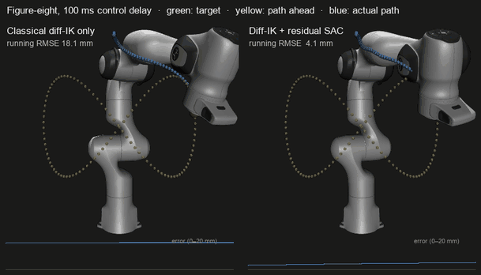
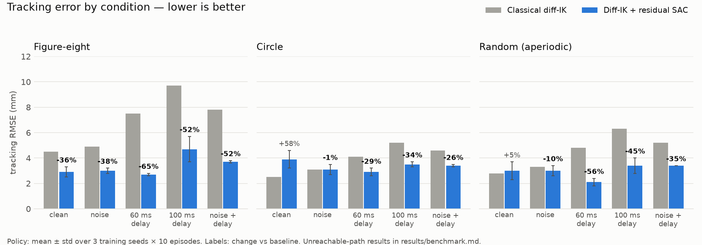
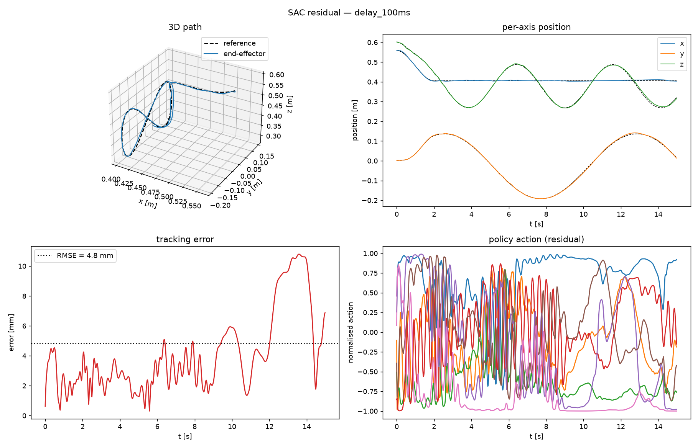

# Residual RL for 3D End-Effector Trajectory Tracking

A Franka Panda arm (MuJoCo) tracks time-varying Cartesian trajectories under
sensor noise, control delay, and partially unreachable references. The
controller combines a **classical differential-IK baseline with a SAC residual
policy**: RL is used where it actually earns its place — recovering performance
in the regimes where classical control measurably breaks.

**Headline:** under 60–100 ms of control delay the residual policy cuts tracking
error by **26–65 %** versus the classical controller on every trajectory type
(e.g. figure-eight at 60 ms: 7.5 mm → 2.7 mm RMSE), averaged over 3 training
seeds × 10 evaluation episodes. It beats the baseline in 14 of 18
trajectory × condition cells; the four where it does not are documented below.



*Same trajectory, same seed, 100 ms control delay. Left: the classical controller
alone lags behind the target. Right: the residual policy uses the trajectory preview
to act early. Bottom strips: tracking error over time.*

---

## Demo

```bash
# Watch the trained policy track a figure-8 live (MuJoCo viewer window)
python scripts/visualise_live.py --model results/final/sac_residual_s0.zip

# 60 ms actuator delay — the regime the policy is built for
python scripts/visualise_live.py --model results/final/sac_residual_s0.zip --delay 3

# Aperiodic random trajectory with 100 ms delay — hardest generalisation test
python scripts/visualise_live.py --model results/final/sac_residual_s0.zip --trajectory random --delay 5

# Same condition, classical baseline only (no --model) — watch it lag
python scripts/visualise_live.py --trajectory random --delay 5

# Half speed for close inspection
python scripts/visualise_live.py --model results/final/sac_residual_s0.zip --speed 0.5
```

The viewer shows three overlaid trails in real time:

| colour | meaning |
|--------|---------|
| green sphere | instantaneous reference target |
| yellow dots | reference path 3 s ahead |
| blue dots | actual EE path over the last 2 s |

---

## Why residual, not RL from scratch?

Trajectory tracking on a clean simulated arm is a solved problem:
damped-least-squares differential IK with velocity feedforward achieves
millimetre-level RMSE with no learning at all. Applying RL to that version
demonstrates nothing. This project instead **quantifies where the classical
controller fails**, then trains a residual policy to fix exactly those failures:

| config (baseline only) | RMSE | max err | smoothness (NDJ) |
|---|---|---|---|
| clean | 4.5 mm | 7.8 mm | 560 |
| obs noise (σ = 5 mm) | 4.9 mm | 8.5 mm | **18,431 (33×)** |
| control delay 60 ms | 7.5 mm | 13.9 mm | 623 |
| control delay 100 ms | **9.7 mm (2.2×)** | 18.7 mm | 645 |
| noise + delay | 7.8 mm | 14.1 mm | 17,911 |
| partially unreachable path | **36.2 mm (8×)** | 80.3 mm | 3,123 |

(figure-eight trajectory, 10 episodes/config — reproduced by `python scripts/run_baseline.py`)

Each uncertainty source breaks the baseline differently:

- **Noise** destroys smoothness — feedback injects it straight into the joint command
- **Delay** adds lag — pure feedback reacts to stale error and cannot anticipate
- **Unreachable segments** cause large error and jerk near the workspace boundary

The residual policy sees trajectory *preview* (0.1 / 0.2 / 0.4 s lookahead), the
baseline's own command, its recent command history and the measured latency, so it
can act predictively — something a memoryless feedback law cannot do.

The residual architecture also keeps the safety story clean: the policy's authority
is bounded (±0.15 rad/s on top of the baseline), so even an untrained or misbehaving
policy degrades toward the classical controller rather than toward chaos — the
property you want before putting a learned policy near hardware.

---

## System design

```
            noisy measurements (shared)
              ┌──────────┴──────────┐
        diff-IK baseline      SAC residual policy
              │                     │
              │               low-pass filter (β = 0.5)
              └──────────┬──────────┘
               q̇ = q̇_ik + 0.15 · ā
                         │
                  [delay buffer]        ← uncertainty
                         │
          integrate → position setpoint
                         │
              MuJoCo position actuators (500 Hz physics, 50 Hz control)
```

**State (89-D).** Joint positions and velocities (7+7), EE position error (3),
EE velocity (3), reference velocity (3), lookahead position errors at +0.1/0.2/0.4 s (9),
the baseline's commanded q̇ (7), previous raw action (7), filtered residual (7),
the last 5 issued joint commands (35), and the measured control latency (1).

- The **lookahead** terms turn delay compensation from an inference problem into a
  representation problem.
- The **command history** lets the policy see what is still "in flight" inside the
  delay buffer.
- The **measured latency** removes a partial-observability trap: without it the
  policy cannot tell a 0 ms episode from a 100 ms one and learns a compromise that
  is mediocre at both. Real control stacks measure latency from timestamps, so this
  input is deployable.

Every block is divided by its typical magnitude (2 cm for position errors, 0.2 m/s
for Cartesian velocities) so the network sees O(1) inputs — otherwise millimetre
errors are invisible next to joint angles of ~0.6 rad.

**Action (7-D).** Joint-velocity residual in [−1, 1], passed through a first-order
low-pass filter (~30 ms time constant), scaled by 0.15 rad/s and added to the
baseline command. Velocity-space control (not torque) matches a real arm's command
interface and is inherently smoother.

**Reward.**
```
r = exp(−‖e‖/5cm) + exp(−‖e‖/1cm) + 0.3·exp(−‖ė‖/0.3) − 0.15·‖Δa‖² − 0.01·‖a‖²
```
Two-scale tracking term (coarse gradient far from the path, fine gradient at the
millimetre level), velocity-matching term, an action-rate penalty as an explicit
anti-jitter regulariser, and a residual-magnitude penalty that keeps the policy
from fighting the baseline where the baseline is already good.

**Trajectories.** Analytic `pos(t)` / `vel(t)` objects — circle, 1:2 Lissajous
figure-eight, sum-of-sinusoids moving target — domain-randomised per episode in
centre, size, and period. The reference is blended in from the robot's start pose
over 2 s with a smoothstep, so metrics reflect steady-state tracking, not a
step-response transient. The policy is conditioned on lookahead samples, not a
trajectory ID, so it generalises across shapes.

**Uncertainty (independently switchable at evaluation).**
1. Gaussian observation noise on joint states and measured EE position, fed to
   *both* baseline and policy (no cheating with clean state)
2. Constant control delay via a FIFO buffer on the commanded velocity
   (3 steps = 60 ms, 5 steps = 100 ms at 50 Hz)
3. Trajectories whose far segments exceed the Panda's ~0.855 m reach

**Training.** SAC (Stable-Baselines3), 600k steps, 2-phase curriculum: clean warm-up
(20 %) → per-episode delay randomisation over 0–100 ms (80 %). Trajectory type is
sampled per episode. Noise and unreachable references are deliberately *not* in the
default training distribution — see [ablations](results/ablations.md) for why.

**Evaluation.** RMSE / max / mean Cartesian error, plus **normalised dimensionless
jerk (NDJ)** of the EE path — a duration- and path-length-invariant smoothness
metric from motor-control literature, so "smooth" is a number, not a claim about
how a video looks. Baseline and policy run head-to-head on identical seeds.

---

## Results

<picture>
  <source media="(prefers-color-scheme: dark)" srcset="docs/media/results_dark.png">
  
</picture>

Policy RMSE, mean ± std over **3 independently trained seeds**, 10 episodes each
([full table with smoothness](results/benchmark.md)):

| condition | figure-eight | circle | random (aperiodic) |
|---|---|---|---|
| clean | 4.5 → **2.9 ± 0.4** (−36 %) | 2.5 → 3.9 ± 0.7 (+58 %) | 2.8 → 3.0 ± 0.7 (+5 %) |
| obs noise | 4.9 → **3.0 ± 0.2** (−38 %) | 3.1 → 3.1 ± 0.4 (−1 %) | 3.3 → **3.0 ± 0.4** (−10 %) |
| delay 60 ms | 7.5 → **2.7 ± 0.1** (−65 %) | 4.1 → **2.9 ± 0.3** (−29 %) | 4.8 → **2.1 ± 0.3** (−56 %) |
| delay 100 ms | 9.7 → **4.7 ± 1.0** (−52 %) | 5.2 → **3.5 ± 0.2** (−34 %) | 6.3 → **3.4 ± 0.6** (−45 %) |
| noise + delay | 7.8 → **3.7 ± 0.1** (−52 %) | 4.6 → **3.4 ± 0.1** (−26 %) | 5.2 → **3.4 ± 0.0** (−35 %) |
| unreachable | 36.2 → 39.0 ± 1.6 (+8 %) | 148.2 → **101.6 ± 13.8** (−31 %) | 57.5 → **56.9 ± 2.5** (−1 %) |

(baseline mm → policy mm; bold = better than baseline)

Reproduce with:
```bash
python scripts/benchmark.py --models results/final/sac_residual_s0.zip \
    results/final/sac_residual_s1.zip results/final/sac_residual_s2.zip
```

Per-condition tracking plots for the figure-eight are in `results/comparison/`.
The 100 ms delay case:



Note the bottom-right panel: several residual channels sit at their ±1 limit for long
stretches — see limitations.

---

## How the result was reached (debugging log)

The first trained policy (`v3`) was **worse than the baseline in every
condition** — 24 mm RMSE on the clean figure-eight vs 4.5 mm for diff-IK alone. The
fixes, in order of impact:

1. **Unscaled observations.** Tracking errors entered the network as ~0.002 while
   joint angles were ~0.6, so the signal the policy most needed was numerically
   invisible. Normalising every observation block to O(1) was the largest single fix.
2. **Excess residual authority.** The residual could add 0.4 rad/s, but the baseline
   only needs ~0.07 rad/s on these paths; measured residuals averaged 0.23 rad/s —
   the policy was overpowering a controller that was already doing well. Authority
   was cut to 0.15 rad/s and a residual-magnitude penalty added.
3. **Coarse reward.** `exp(−e/5cm)` barely separates 1 mm from 5 mm. A second 1 cm
   term restores gradient at the millimetre level.

After these fixes a clean-only warm-up policy reached ~1 mm RMSE (≈3–4× better than
the baseline) on all three trajectory types — but collapsed under delay, while the
policy trained on the full randomised mix handled delay yet lost clean accuracy.

4. **Partial observability.** The policy could not tell which condition it was in,
   so it learned a compromise. Measured latency was added to the observation.
5. **A poisoned training distribution.** The mixed-condition policy still lost to
   the baseline. Its actions carried a large constant bias on some joints (mean
   −0.62 on joint 1 vs −0.14 for the warm-up policy), which the baseline's feedback
   then fought, leaving a steady-state offset. A one-factor-at-a-time
   [ablation](results/ablations.md) isolated the cause: training on unreachable
   references alone reproduced the bias and made the clean circle 143 % worse.
   Dropping unreachable references (and noise, which mainly made the policy
   cautious) from training raised the win count from 3/18 to 14/18 conditions.

---

## Running it

```bash
pip install -r requirements.txt

# 1. Reproduce the baseline degradation table (fast, no training needed)
python scripts/run_baseline.py --trajectory figure8

# 2. Train the residual policy (600k steps, ~25–30 min on a multi-core laptop CPU)
python scripts/train.py --seed 0

# 3. Head-to-head comparison on one trajectory, with plots (and --video)
python scripts/evaluate.py --model results/training/sac_residual_final.zip

# 4. Multi-seed benchmark over every trajectory x condition
python scripts/benchmark.py --models <one .zip per seed>

# 5. Regenerate the README GIF and results charts
python scripts/make_media.py

# Ablations
python scripts/train.py --max-noise 0.005                    # add noise randomisation
python scripts/train.py --unreachable-p 0.3                  # add unreachable references
python scripts/train.py --mode rl_only                       # RL from scratch, no baseline
python scripts/train.py --no-curriculum                      # skip the clean warm-up
```

---

## Repo layout

```
assets/franka_emika_panda/   MuJoCo Menagerie Panda model (BSD-licensed)
envs/trajectories.py         analytic reference trajectories + domain randomisation
envs/tracking_env.py         Gymnasium env: residual control, uncertainty injection
controllers/diff_ik.py       damped-least-squares differential IK baseline
scripts/run_baseline.py      experiment 1: where classical control breaks
scripts/train.py             SAC training with 2-phase curriculum + ablation flags
scripts/evaluate.py          experiment 2: baseline vs policy on one trajectory
scripts/benchmark.py         experiment 3: multi-seed, all trajectories x conditions
scripts/eval_utils.py        rollouts, metrics (RMSE, NDJ), plots, video
scripts/visualise_live.py    live MuJoCo viewer with EE trail and reference path
scripts/make_media.py        README GIF and results charts (docs/media/)
results/final/               trained checkpoints, 3 seeds
results/benchmark.md         headline results table
results/ablations.md         which training uncertainty helps / hurts
```

---

## Honest limitations

- **Smoothness.** The policy is less smooth than the baseline (NDJ 3–7× higher in
  clean and delayed conditions), despite the output filter and action-rate penalty.
  A larger rate penalty or a jerk term in the reward is the next thing to try.
- **Action saturation.** Several residual channels spend long stretches at their ±1
  limit (see the 100 ms tracking plot), which coincides with the largest error
  spikes. The policy still carries some constant joint bias; likely candidates are
  drift in the arm's 4-D null space (7 joints, 3-D task) and the residual cap being
  too tight for delay compensation. Projecting the residual onto the task space, or a
  bias penalty, are the next experiments.
- **Clean circle.** On the easiest reference the policy is worse than the baseline
  (3.9 vs 2.5 mm): the baseline already sits near its floor and the residual adds
  small errors of its own.
- **Unreachable references are not solved by the policy**, by design. The right fix
  is to clamp the reference to the reachable workspace upstream of the controller.
- **Noise is not in the training distribution.** The policy is still no worse than
  the baseline under noise, but it does not actively filter it; a state estimator
  (e.g. a Kalman filter) in front of both controllers is the principled fix.
- **Latency is assumed measured and constant within an episode.** Real latency
  jitters; randomising it within episodes is the next robustness step.
- **The baseline is untuned.** A delay-compensated classical controller (e.g. a Smith
  predictor using the same lookahead) is the fairer comparison and has not been run.
- Orientation tracking is not implemented, and sim-to-real transfer has not been
  tested (unmodelled joint friction and motor dynamics are the main gap).
